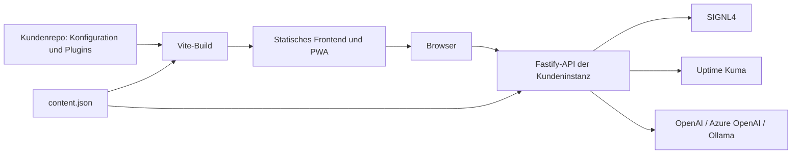

# Architektur und Repository

## Instanzen und Datenfluss

Jede Kundeninstanz besitzt Branding, Inhalte, Plugin-Registrierung und Lockfile. Die Anwendung importiert Core, SDK und Plugins als npm-Pakete. Plugins werden beim Build eingebunden; im Browser findet kein dynamischer Download von Plugin-Code statt.

Der Browser enthält ausschließlich die öffentliche Konfiguration aus `publicConfig`. Core registriert außerdem die Tools der installierten Plugins über WebMCP (`packages/core/src/webmcp.ts`, Hilfen im SDK), sofern der Browser die Schnittstelle bietet und `public.webmcp` nicht `false` ist; die Tools rufen dieselben öffentlichen `/api/v1`-Routen wie die Oberfläche, die API bleibt unverändert ([WebMCP](webmcp.md)). Die API validiert die Konfiguration aller Server-Plugins vor ihrer Registrierung. Pro API-Prozess teilen sich Plugins einen `LiveCache` und eine Wissensquellen-Map für den Chat.

## Repository-Struktur

| Pfad                 | Verantwortung                                                                                 |
| -------------------- | --------------------------------------------------------------------------------------------- |
| `packages/sdk`       | TypeScript-Verträge, Zod-Inhaltsschema, Plugin-Prüfung, Live-Cache, Browser-Hooks und vCards  |
| `packages/core`      | React-Shell und Styles, öffentliche Konfiguration, Vite/PWA-Build und Fastify-Host            |
| `packages/cli`       | Profil validieren, Kundenrepo initialisieren, entwickeln, bauen/starten und Plugins verwalten |
| `packages/plugin-*`  | Kontakt, SIGNL4, Kuma, Inhalte und Chat als unabhängige Pakete                                |
| `apps/demo`          | Vollständige synthetische Demo mit allen fünf Plugins                                         |
| `apps/northstar`     | Zweite Marke mit Kontakt, Inhalten und Chat                                                   |
| `templates/customer` | Deklaratives Kundenprofil, Inhalte und kurzer Aufruf des gemeinsamen Workflows                |
| `scripts`            | Versions-/Paketprüfung, Vorlagensynchronisation, Paket-Smoke-Test und Wiki-Abgleich           |
| `tests`              | Unit-/Integrationstests; `tests/browser` enthält Playwright-Fälle                             |
| `docs`               | Quellen für die Projekt- und Wiki-Dokumentation                                               |
| `.github/workflows`  | CI, Release Please/npm-Veröffentlichung und Wiki-Spiegelung                                   |

`scripts/sync-template.mjs` übernimmt die Kunden-Vorlage beim CLI-Build und ersetzt Workspace-Abhängigkeiten durch die aktuellen Paketversionen. Die generierte Kopie unter `packages/cli/template` wird nicht manuell bearbeitet.

## Paketfamilie

Die neun öffentlichen Pakete heißen `@kieksme/csp-sdk`, `@kieksme/csp-core`, `@kieksme/csp-cli` und `@kieksme/csp-plugin-{contact,signl4,kuma,content,chat,teams}`. Alle erhalten dieselbe Release-Version. Private Apps und Kunden-Vorlage werden ebenfalls versioniert, aber nicht auf npm veröffentlicht.

Die Core-API trennt Exporte für `./browser`, `./server`, `./config`, `./profile` und `./build`. Plugins haben getrennte Browser- und Server-Exporte. SDK-Kompatibilität und Plugin-Abhängigkeiten werden zur Laufzeit überprüft. Kundenupdates erfolgen über Paketversionen und Lockfile mit anschließendem Build und Deployment.

## Cache und Offline-Verhalten

Provider-Daten werden je Prozess 30 Sekunden im Speicher gehalten. Gleichzeitige Abfragen desselben Cache-Schlüssels werden gebündelt. Bei Fehlern bleibt der letzte Erfolg als `stale: true` verfügbar; ohne erfolgreichen Vorwert ist `data: null`. Fehlversuche werden ebenfalls für die Cache-TTL gebremst.

Das Frontend pollt standardmäßig alle 60 Sekunden. Schichtgrenzen werden lokal alle 15 Sekunden neu bewertet. Die PWA lädt nach einem ersten erfolgreichen Besuch statische Hilfe und Assets auch offline. API- und Chat-Antworten werden nicht im Service Worker gespeichert; externe Bilder benötigen weiterhin Netzwerkzugriff.

Weiter: [Plugins](plugins.md), [API](api.md), [Betrieb](operations.md).

Das optionale Teams-Plugin ergänzt PostgreSQL-Persistenz, Entra-Zugriffsschutz und menschliche Übernahme. Frontend und Runtime aktivieren diese Funktion explizit. Details: [Teams-Support](teams-support.md).

## Infrastruktur der eingerichteten Instanzen

Die [Infrastrukturübersicht](infrastructure.md) dokumentiert Hosting, Netzgrenzen, Releasewege und den belegten Live-Stand. Details: [Coolify](infrastructure-coolify.md), [Thinkport und Teams](infrastructure-thinkport.md), [Lieferkette und Wiederherstellung](infrastructure-operations.md).
