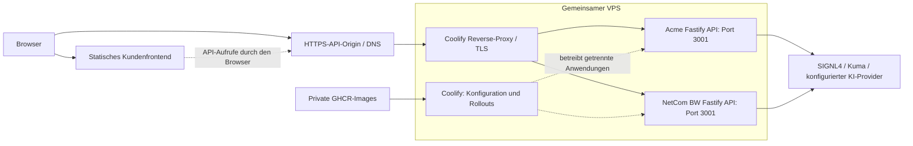

# Acme und NetCom BW auf Coolify

Stand und Instanzinventar: [Infrastrukturübersicht](infrastructure.md). Die APIs laufen als getrennte Anwendungen auf einem gemeinsamen VPS. Der Coolify-Server ist ein eigener Verwaltungsdienst; seine Oberfläche und Zugangsdaten gehören nicht zum öffentlichen Portal.

## Architektur

Der interne Port darf in beiden Containern gleich sein; der Proxy entscheidet anhand des Hostnamens. Die Kunden teilen Host-Ressourcen, aber nicht automatisch Konfiguration, Inhalte oder API-Schlüssel. Ein Host-Ausfall kann beide Instanzen treffen.

## Build und Rollout

1. Kundenrepo aktualisiert CSP-Pakete und Lockfile; CI validiert Profile und baut Frontend/API.
2. Der Kundenworkflow veröffentlicht das API-Image in seinem privaten GHCR-Paket. GitHub Actions benötigt Schreibrechte für genau dieses Paket; Pull-Zugänge des Hosts werden getrennt verwaltet.
3. Coolify lädt die gewünschte Image-Version und führt den Rollout der entsprechenden Anwendung aus. Ein Push nach GHCR bestätigt noch keinen Rollout.
4. Runtime-Secrets und Origins werden an der Anwendung gesetzt. `.env` und Provider-Schlüssel werden nicht in Git oder im Frontend veröffentlicht.
5. Laufenden Image-Stand, Container-Healthcheck und externes `/health` prüfen; danach echte Providerdaten und Chat separat testen.

Das Frontend-Deployment ist unabhängig. Ein API-Rollout aktualisiert kein bereits veröffentlichtes statisches Frontend. Beim gemeinsamen Upgrade oder Rollback müssen Kundencommit, Lockfile, Frontend-Artefakt, API-Image und Runtime-Konfiguration zusammenpassen.

## Healthchecks und Ressourcen

Der API-Healthcheck verwendet `GET /health`, intern `localhost:3001`, erwarteter Status `200`, Intervall 30 Sekunden, Timeout 5 Sekunden und Startzeit 15 Sekunden. Das Kundenimage enthält `curl`. Ein gesundes `/health` bestätigt den Prozess und seine registrierten Plugins, keine Provider-Anmeldung.

Builds und parallele Rollouts können auf dem gemeinsam genutzten Host Speicherdruck erzeugen. Zunächst RAM, Swap, Pressure-Stall-Daten, Containerverbrauch und Deploymentwarteschlangen lesen. Rollouts bei Engpässen nacheinander ausführen. Der für die vorherige Aktualisierung genehmigte temporäre Swap wurde wieder entfernt; er ist keine dauerhafte Infrastrukturkomponente.

## Rücksetzen und Betrieb

Vor einem Rollout den laufenden unveränderlichen Image-Stand und die dazugehörige Konfiguration festhalten. Bei Fehlern auf diesen Stand zurückrollen und externe Erreichbarkeit erneut prüfen. `latest` ist kein verlässlicher Rollbackbezug. Provider-Schlüsselrotation und Coolify-Verwaltung sind getrennte Betriebsänderungen.

Logs und Metriken dürfen keine Tokens, Geheimnisse oder vollständigen Kundengespräche enthalten. Überwachen: externe Erreichbarkeit, TLS, Containerneustarts, Provider-Fehler, RAM/Disk und Rolloutfehler. Auf einem gemeinsamen Host keine anderen Anwendungen im Rahmen einer CSP-Wartung neu starten.

Weiter: [Deployment](deployment.md), [Lieferkette und Betrieb](infrastructure-operations.md).
