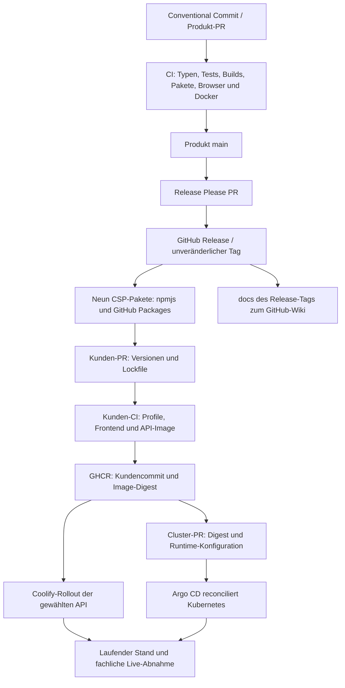

# Infrastruktur: Lieferkette, Betrieb und Wiederherstellung

Die [Infrastrukturübersicht](infrastructure.md) enthält den belegten Instanzstand. Diese Seite erklärt, wie eine Änderung vom Produkt bis zur laufenden Instanz gelangt und welche Prüfungen dabei unterschiedliche Aussagen belegen.

## Release- und Deploymentarchitektur

Produktrelease, Kundenimage und Instanzrollout sind getrennte Vorgänge. Release Please verwaltet Versionen und Changelog; Tags werden nicht für eine Dokumentationskorrektur nachträglich verändert. Das Wiki zeigt die Dokumentation des gespiegelten Release-Tags. Änderungen unter `docs/` gelangen mit dem nächsten Release über den vorhandenen Wiki-Job dorthin, siehe [Wiki-Ablauf](wiki.md).

Thinkport-Images werden ausschließlich von der Kunden-CI gebaut. Kubernetes- und Anwendungskonfiguration kommen ausschließlich aus dem Clusterrepo über Argo CD. Kein direktes `kubectl apply` und kein nachträgliches Setzen von App-Konfiguration am laufenden Pod. Neue Secret-Werte werden in Key Vault verwaltet, Referenzen und Verbrauch über GitOps.

## Konfigurations- und Secret-Grenzen

| Datentyp                                         | Quelle                              | Änderung / Wirkung                                                   |
| ------------------------------------------------ | ----------------------------------- | -------------------------------------------------------------------- |
| Branding, öffentliche Origins und Plugin-Auswahl | Kundenprofil und Lockfile           | Frontend/API neu bauen; Browserwerte sind öffentlich                 |
| Runtime-Provider und API-Origin-Allowlist        | Coolify oder GitOps-ConfigMap       | Dienst neu starten / deklarativ ausrollen                            |
| Provider- und App-Secrets                        | Hosting-Secrets oder Key Vault      | Kontrolliert rotieren; Erneuerung der konsumierenden Prozesse prüfen |
| Private Registry-Pull-Zugangsdaten               | Hostverwaltung oder External Secret | Nur Pull für benötigte private Images                                |
| Teams-App-RSC                                    | Installation im ausgewählten Team   | App-/Team-Zuordnung und beide tatsächlichen Grants prüfen            |
| Gesprächsdaten                                   | PostgreSQL und Teams                | Getrennte Aufbewahrung, Zugriffsrechte und Backups                   |

Build-Secrets, Registry-Schreibrechte und Runtime-Provider-Zugänge sind keine austauschbaren Berechtigungen. GitHub Actions darf ein Paket veröffentlichen, ohne dadurch Zugriff auf Portal-Gespräche zu erhalten. Betreiber prüfen Secret-Erneuerung am Verbraucher und geben dabei keine Werte aus.

## Überwachung und Nachweis

| Prüfung                         | Belegt                                            | Belegt nicht                                  |
| ------------------------------- | ------------------------------------------------- | --------------------------------------------- |
| Produkt-/Kunden-CI              | Geprüften Quellstand, Builds und definierte Tests | Zugang zu realen Kundendiensten               |
| Registry-Push                   | Veröffentlichtes Image samt Digest                | Nutzung durch die laufende Instanz            |
| Coolify-Rollout / Argo `Synced` | Ausgerollte bzw. abgeglichene Konfiguration       | Vollständige fachliche Funktion               |
| Containerprobes / `/health`     | Prozessbereitschaft                               | Provider, Entra, Teams oder Graph erreichbar  |
| Externer HTTPS-Aufruf           | DNS, TLS, Proxy und Route                         | Inhaltlich korrekte Live-Daten                |
| Echter Nutzer- und Teams-Test   | Geprüfte vollständige Strecke                     | Dauerhafte Verfügbarkeit oder Backupfähigkeit |

Regelmäßig prüfen: API-Latenz und Fehler, Containerneustarts, Zertifikatsablauf, VPS-RAM/Disk, Kubernetes-Events, ExternalSecret-Status, Datenbank-/PVC-Kapazität sowie Outbox-Rückstau und Zustellversuche. Graph-Ausfälle müssen Supportaktionen verweigern; nach Übernahme darf ein Teams-Ausfall die KI nicht freigeben. Keine Tokens oder Gesprächsinhalte in Alarmtexten veröffentlichen.

## Rollback und Wiederherstellung

Bei statischen Instanzen vorheriges Frontend-Artefakt und passendes API-Image samt Profil, Lockfile und Runtime wiederverwenden. Bei Thinkport den geprüften GitOps-Stand per Revert-PR zurücksetzen und Argo-Abgleich beobachten. Ein alter Code-Digest setzt keine Datenbank und keine Entra-/Teams-Berechtigungen zurück.

Vor Datenbankmigrationen Restore-Kompatibilität und Backup prüfen. Secret-Rotation, Datenbankschema und externe Bot-/Entra-Konfiguration getrennt protokollieren. Ein einzelner API-Prozess mit `Recreate` hat bei Pod-Ersatz eine Unterbrechung; horizontale Skalierung ist erst nach Verteilung von Limits, Generierungsjobs und Worker-Leases möglich.

Backupbedarf:

- Versionierte Profile, Manifeste und Lockfiles in den zuständigen Git-Repositories.
- Verfügbarkeit älterer unveränderlicher Image-Digests und Frontend-Artefakte sichern.
- PostgreSQL-Backups getrennt vom PVC speichern, verschlüsseln und Restore regelmäßig testen.
- RPO, RTO und Aufbewahrung je Instanz festlegen; hierfür ist noch kein abgeschlossener Thinkport-Support-Backupbetrieb nachgewiesen.
- Teams-Aufbewahrung mit Portal-Löschung und Backup-Aufbewahrung abstimmen; Portal-Löschung entfernt keine Teams-Kopie.

## Zuständigkeiten bei Störungen

Frontend-/Paketfehler gehen an die Produkt-/Kundenentwicklung; Host-/Rolloutfehler an den Coolify- bzw. AKS-Betrieb. Portal-Anmeldung und App-Zuweisung gehören zur Entra-Verwaltung. Teams-App-Freigabe, RSC und Teammitgliedschaft gehören zur Teams-Verwaltung. Microsoft-Connector- und Provider-Störungen müssen mit realen Fehlercodes und Zustellnachweisen eingegrenzt werden; ein gesunder Pod löst sie nicht.

Weiter: [Betrieb und Releases](operations.md), [Fehlerbehebung](troubleshooting.md), [Teams-Support](teams-support.md).
