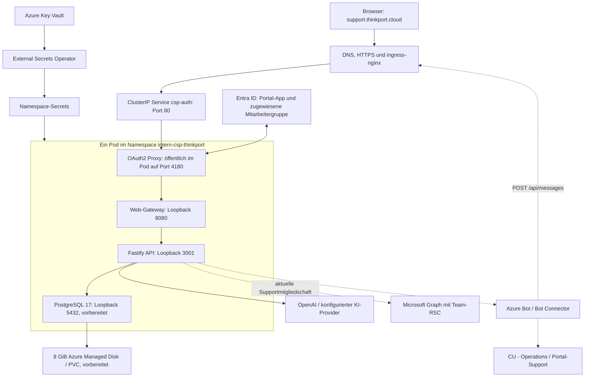
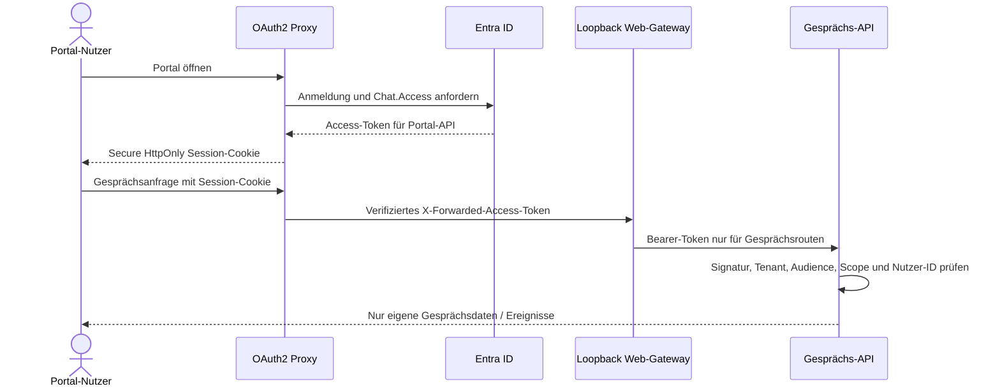
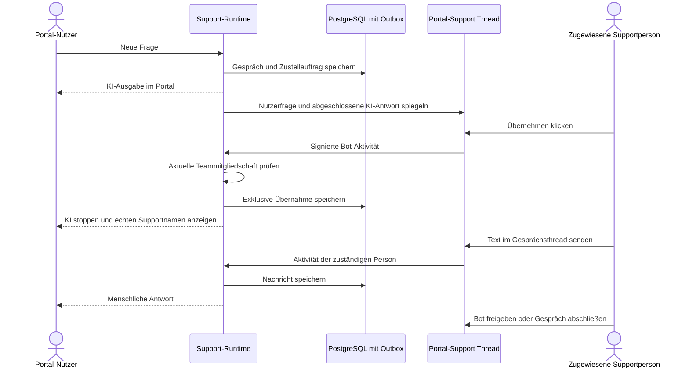

# Thinkport: privates Portal und Teams-Support

Stand: **11. Oktober 2026**. Das Portal läuft auf dem vorhandenen AKS-Cluster. Die Teams-Erweiterung ist vorbereitet und noch nicht produktiv abgenommen. Das Kundenrepo [csp-thinkport](https://github.com/kieksme/csp-thinkport) hält Profil, Hosting-Gateway und App-Paket; das geschützte Clusterrepo [tp-cluster](https://github.com/ThinkportRepo/tp-cluster) hält die vollständigen Instanzkennungen, Manifeste und Azure-Bot-Definition.

## Laufende und vorbereitete Komponenten

| Komponente           | Laufender Stand                                                                | Vorbereitete Erweiterung                                                |
| -------------------- | ------------------------------------------------------------------------------ | ----------------------------------------------------------------------- |
| Kubernetes-Anwendung | Argo CD `csp-thinkport-dev`, Namespace `intern-csp-thinkport`, ein Pod         | Gleiche Anwendung, ein API-Replikat und `Recreate`                      |
| Anmeldung            | OAuth2 Proxy vor Web und API, Single-Tenant-Entra-App                          | Delegierter `Chat.Access`-Scope und erneuerte Session-Cookies           |
| Web / API            | CSP 0.7.0, drei bereite Container einschließlich Auth-Proxy                    | CSP 0.8.0, privater Session-Gateway für Gesprächsrouten                 |
| Datenbank            | Kein Support-PVC im laufenden Namespace                                        | PostgreSQL 17 als nativer Sidecar, 8 GiB `managed-csi`-PVC              |
| Secrets              | Externe Secrets für Auth, Runtime und Registry sind `Ready`                    | Zusätzliche Bot- und Datenbank-Secrets aus Key Vault                    |
| Teams                | Privates Team **CU - Operations**, Channel **Portal-Support**, Owner bestätigt | App-Installation und beide RSC-Freigaben fehlen noch                    |
| Azure Bot            | Single-Tenant-Bot provisioniert, Endpoint definiert                            | Teams-Channel-Aktivierung und Zustimmung zu Microsoft-Bedingungen offen |

Die aktive Konfiguration liegt im `dev`-Overlay; Basis, `staging` und `prod` werden nicht automatisch mit aktiviert. Der Name `dev` ist kein Beleg für Demo-Authentifizierung: die veröffentlichte Domain ist geschützt. Bereitschaft, Kontakte und Status bleiben dort synthetisch gekennzeichnet; der konfigurierte KI-Provider ist separat live zu prüfen.

## Zielarchitektur nach Freigabe

Gestrichelte Verbindungen kennzeichnen externe Supportabhängigkeiten, deren vollständige Live-Strecke noch nicht abgenommen ist.

Nur OAuth2 Proxy ist über den Service erreichbar. Web, API und die vorbereitete Datenbank binden an Pod-Loopback; es gibt keine öffentlichen Backend-/Datenbank-Services. Der aktuelle Cluster verwendet kubenet; die Durchsetzung der NetworkPolicy durch eine Policy-Engine ist nicht bestätigt. Die dokumentierte Isolation beruht deshalb zusätzlich auf dem Loopback-Binding, nicht auf einer behaupteten NetworkPolicy-Wirkung.

## Azure- und Kubernetes-Plattform

OpenTofu im Clusterrepo verwaltet die Azure-Grundlage: Netzwerk/VNet, AKS, Key Vault und die zugehörigen Identitäten. Die CSP-Anwendung nutzt diese gemeinsame Plattform; Änderungen daran sind kein Kundenimage-Deployment. Argo CD trennt Plattformdienste in `system-*` von internen Anwendungen in `intern-*`. Das `intern`-AppProject begrenzt zulässige Namespaces und Ressourcentypen; die vorbereitete Datenhaltung ergänzt namespacegebundene PVCs.

AKS stellt OIDC und Azure Workload Identity für den External Secrets Operator bereit. Dessen ServiceAccount greift über die zugewiesene Identität auf Key Vault zu; die CSP-App erhält die benötigten Namespace-Secrets. Im CSP-Pod ist das automatische Mounten eines Kubernetes-ServiceAccount-Tokens deaktiviert. Private Kundenimages werden mit dem dedizierten `ghcr-read`-ImagePullSecret geladen. GHCR ist die hier verwendete Kundenregistry; ein Plattform-ACR ist kein Beleg, dass CSP-Images daraus gezogen werden.

TLS wird von cert-manager über den ClusterIssuer `letsencrypt-prod` und HTTP-01 am nginx-Ingress bereitgestellt. Das Zertifikat liegt als `support-thinkport-tls` im Anwendungsnamespace. Der Ingress schaltet Response-Buffering aus und setzt Read-/Send-Timeouts auf 180 Sekunden; OAuth2 Proxy und Web-Gateway berücksichtigen das Streaming ebenfalls. Das interne KI-Zeitlimit bleibt eine separate Produktgrenze.

Die vorbereiteten Container laufen auf Linux/amd64, ohne zusätzliche Linux-Capabilities, ohne Privilege Escalation, mit `RuntimeDefault`-seccomp und schreibgeschütztem Root-Dateisystem. Web-/API-Probes laufen innerhalb des Pods, weil Kubelet ihre Loopback-Ports nicht direkt erreicht.

| Container im Zielstand | CPU Request / Limit | RAM Request / Limit | Datenhaltung                                        |
| ---------------------- | ------------------- | ------------------- | --------------------------------------------------- |
| OAuth2 Proxy           | 50m / 250m          | 64 MiB / 128 MiB    | Cookie-/App-Secrets, ConfigMap                      |
| Web-Gateway            | 50m / 250m          | 64 MiB / 128 MiB    | Statische Image-Dateien                             |
| Fastify API            | 100m / 500m         | 128 MiB / 512 MiB   | Gesprächsdaten in PostgreSQL, temporäres `emptyDir` |
| PostgreSQL-Sidecar     | 100m / 500m         | 128 MiB / 384 MiB   | 8-GiB-PVC; Laufzeitverzeichnis in `emptyDir`        |

Die Tabelle beschreibt den vorbereiteten Overlay-Stand, keine Kapazitäts- oder Lasttestzusage. Disk-Anbindung, Node-Kapazität und Secret-Verfügbarkeit müssen vor dem Rollout passen.

## Anmeldung und Token-Grenzen

`chatSupport.auth: session` nutzt die vorhandene Portal-Anmeldung. Bearer-Tokens bleiben hinter dem Proxy. Der Proxy muss callerseitige Auth-Header ersetzen; das Gateway reicht keine Browsercookies und keine frei gewählten Bearer-Tokens an Gesprächsrouten weiter. Die API prüft selbst das Access-Token und bindet den Gesprächsbesitz an Tenant und Nutzer-ID. Fremde Gesprächs-IDs liefern 404.

Browser-Schreibzugriffe benötigen die exakte HTTPS-Origin und JSON. Private Antworten werden nicht gecacht; der private Build entfernt Service Worker, Offline-Cache und Webmanifest. Portal-Zugriff bleibt durch erforderliche Entra-App-Zuweisung und die vorhandene Mitarbeitergruppe begrenzt. Das ist eine andere Gruppe als die Supportberechtigung im Teams-Team.

Nur der exakte `POST /api/messages`-Webhook darf die interaktive Anmeldung umgehen. Der Bot-Connector-Bearer wird zum Teams SDK weitergereicht und dort geprüft; ungültige oder fehlende Tokens dürfen keine Aktivitäten auslösen. Diese Ausnahme öffnet keine anderen API-Pfade.

## Teams, Rollen und Übernahme

Für die Zielinstanz sind Supportgruppe und Team dieselbe Microsoft-365-Gruppe. `CSP_TEAMS_SUPPORT_AUTH=team` benötigt `TeamMember.Read.Group` und `ChannelMessage.Read.Group` als Resource-Specific Consent bei Installation. Es sind keine tenantweiten Graph-Anwendungsrechte für diesen Modus vorgesehen. Nachrichtenleserechte gelten für alle Channels des installierten Teams; die Anwendung verarbeitet nur zugeordnete Threads im konfigurierten Channel. Mitgliedschaft wird bei jeder Supportaktion frisch geprüft; bei Graph-Fehlern wird die Aktion verweigert.

Alle neuen Textantworten der zuständigen Supportperson im übernommenen Thread werden Portal-Antworten. Andere Personen können dort intern diskutieren; die zuständige Person muss interne Diskussionen an einem anderen Ort führen. Der Bot bleibt bis zur ausdrücklichen Freigabe pausiert. Anhänge, Änderungen und Löschungen sind nicht synchronisiert. Weitere Verträge: [Teams-Support](teams-support.md).

Team-Ownership ermöglicht Teamverwaltung, hebt aber keine Custom-App-Richtlinie auf. Im aktuellen Teams-Client ist nur die Einreichung an die Organisation verfügbar. Ein berechtigter Teams-Administrator muss die vorbereitete App freigeben oder Custom-App-Upload für das Konto ermöglichen. Der Azure-Bot-Teams-Channel bleibt bis zur Zustimmung zu den Microsoft-Bedingungen deaktiviert. Cluster-Aktivierung: [vorbereiteter PR #42](https://github.com/ThinkportRepo/tp-cluster/pull/42), Zielzuordnung: [Kunden-PR #8](https://github.com/kieksme/csp-thinkport/pull/8).

## Persistenz und Secret-Verwaltung

PostgreSQL läuft im Ziel als nativer restartbarer Init-Sidecar mit Startprobe vor dem API-Start. Die API beendet sich beim Pod-Shutdown vor PostgreSQL. Kubernetes 1.34 wurde am Cluster geprüft. Die Datenbank läuft nicht als root, mit schreibgeschütztem Root-Dateisystem und begrenzten Schreibvolumes. Die Loopback-Verbindung verwendet kein TLS; bei einer späteren externen Datenbank ist die Transportabsicherung neu zu planen.

Ein `ReadWriteOnce`-PVC hält Daten über Pod-Ersatz hinweg. Eine einzelne Runtime besitzt einen PostgreSQL-Advisory-Lock. Verlauf, Gesprächseigentümer, Supportzuständigkeit, Teams-Zuordnung und Outbox bleiben gespeichert; unvollständige KI-Ausgaben werden nach Neustart als unterbrochen abgeschlossen. Teams-Zustellung ist `at least once`, nicht `exactly once`.

External Secrets liest Key Vault über den vorhandenen ClusterSecretStore und erzeugt Namespace-Secrets für Portal-App, Cookie, OpenAI, GHCR-Pull, Bot und Datenbank. Keine Secret-Werte in Git, Build-Argumenten oder Logs. Das Bot-Secret muss vor seinem derzeitigen Ablauf am **8. April 2027** rotiert werden. Eine Änderung des DB-Passworts in Key Vault allein ändert kein initialisiertes PostgreSQL-Passwort; Rotation muss beide Seiten koordinieren.

Standardmäßig werden Portal-Gespräche nach 30 Tagen ohne Aktivität gelöscht. Teams-Kopien und Backups haben eigene Aufbewahrung. **Ein PVC ist kein Backup.** Ein geplanter Backup-/Restoreprozess mit getesteter Wiederherstellung sowie definiertem RPO/RTO ist noch eine offene Betriebsaufgabe.

## Freigabe und Live-Abnahme

Vor Argo-Rollout müssen App-Installation, beide RSC-Grants und der aktivierte Bot-Teams-Channel nachgewiesen sein. Danach testen: erlaubte/abgewiesene Anmeldung, zwei getrennte Nutzerverläufe, Spiegelung von Nutzer- und KI-Nachricht, Übernahme während Streaming, echter Supportname, menschliche Antwort, Freigabe und Abschluss. Zusätzlich Refresh/Neustart-Persistenz, ungültige Webhook-Tokens, CSRF und fehlende Offline-Speicherung prüfen. Ein lokaler PostgreSQL-Smoke-Test, CI oder `/health` ersetzt diese Abnahme nicht.

Weiter: [Lieferkette und Betrieb](infrastructure-operations.md), [Sicherheit](security.md).
