# Infrastrukturübersicht

Diese Seite dokumentiert die Infrastruktur der CSP-Produktfamilie und der eingerichteten Kundeninstanzen. Stand: **11. Oktober 2026**. Sie unterscheidet laufende Infrastruktur, vorbereitete Änderungen und offene Betriebsaufgaben. Eine erfolgreiche CI oder ein gesunder Prozess ersetzt keinen Test der Provider oder der vollständigen Supportstrecke.

## Systemgrenzen und Verantwortlichkeiten

```mermaid
flowchart TB
  Product["CSP-Produktrepository: Core, SDK, CLI und Plugins"] --> Registry["npmjs und GitHub Packages"]
  Registry --> Customers["Kundenrepositories: Branding, Inhalte und Lockfile"]
  Customers --> CI["GitHub Actions: Validierung und Kundenbuild"]
  CI --> Static["Statisches Frontend / GitHub Pages"]
  CI --> Images["Private Kundenimages in GHCR"]
  Images --> Coolify["Coolify: Acme und NetCom BW API"]
  Images --> GitOps["Thinkport Clusterrepo: Image-Digests und Kubernetes-Manifeste"]
  GitOps --> Argo["Argo CD"]
  Argo --> AKS["AKS: privates Thinkport-Portal"]
  Browser["Browser"] --> Static
  Browser --> AKS
  Static --> Coolify
  Coolify --> Providers["SIGNL4, Uptime Kuma und KI-Provider"]
  AKS --> Providers
  AKS -. "vorbereiteter Teams-Support" .-> Teams["Azure Bot, Microsoft Graph und Teams"]
```

| Ebene            | Quelle / Betreiber                            | Aufgabe                                                                       |
| ---------------- | --------------------------------------------- | ----------------------------------------------------------------------------- |
| Produkt          | [kieksme/csp](https://github.com/kieksme/csp) | Gemeinsame Pakete, Kundenworkflow, Verträge, Tests und Wiki-Quellen           |
| Kundeninstanz    | Eigenes Kundenrepo                            | Profil, Plugins, Inhalte, Assets, Lockfile und kundenspezifisches Hosting     |
| Artefakte        | GitHub Actions, npmjs, GitHub Packages, GHCR  | Reproduzierbare Builds und unveränderliche Versions-/Image-Zuordnung          |
| Acme / NetCom BW | Coolify auf gemeinsamem VPS                   | Separate API-Container, Runtime-Konfiguration, Reverse-Proxy und Healthchecks |
| Thinkport        | AKS und Argo CD                               | Geschütztes Portal, Anmeldung, Kubernetes-Konfiguration und Secret-Zufuhr     |
| Externe Dienste  | Jeweilige Anbieter                            | Bereitschaft, Status, KI, Identität und Teams-Zustellung                      |

Das öffentliche Wiki enthält Architektur, Rollen und Betriebsabläufe. Geheimnisse, interne Hostadressen, Azure-Abonnement-/Tenant-IDs und personenbezogene Supportdaten gehören in die zugriffsgeschützten Instanz- und Infrastrukturquellen.

## Instanzinventar und belegter Zustand

| Instanz                 | Hosting / Eintrittspunkt                         | Stand und Nachweis                                                                                         |
| ----------------------- | ------------------------------------------------ | ---------------------------------------------------------------------------------------------------------- |
| Produktdemos            | GitHub Pages / statische Builds                  | Synthetische Daten; kein Nachweis einer produktiven Provider-Anbindung                                     |
| Acme                    | Coolify, `https://csp-acme.kieks.me/health`      | CSP 0.7.0 ausgerollt; HTTP 200 am Dokumentationsstand bestätigt                                            |
| NetCom BW               | Coolify, `https://csp-netcom-bw.kieks.me/health` | CSP 0.7.0 ausgerollt; HTTP 200 am Dokumentationsstand bestätigt                                            |
| Thinkport               | AKS, `https://support.thinkport.cloud`           | Argo CD `Synced` / `Healthy`, ein Pod mit drei bereiten Containern; live weiterhin CSP 0.7.0               |
| Thinkport Teams-Support | Vorbereitete CSP-0.8.0-Konfiguration             | Images veröffentlicht; Aktivierung noch nicht ausgerollt. Teams-App, RSC und Bot-Channel-Aktivierung offen |

Die neuen Thinkport-Images wurden aus Kundencommit `d488f939ef0939e14807f05d5a2150f522f18bec` veröffentlicht. Der laufende Pod verwendet noch Images aus `ed289c5d188d770cda841075bdc5065dcc80e399`. Ein Digest im vorbereiteten Manifest ist kein Deploymentnachweis. Aktuelle Versionsstände immer am Kunden-Lockfile, Registry-Artefakt und laufenden Container gemeinsam prüfen.

## Netz, DNS und TLS

Jede Instanz benötigt einen DNS-Namen zum tatsächlichen Hosting-Eintrittspunkt und ein gültiges HTTPS-Zertifikat. `CSP_DOMAIN` erzeugt Metadaten und legt keinen DNS-Eintrag an. GitHub Pages verwaltet Frontend-Hosting getrennt vom API-Host. Coolify terminiert TLS am Reverse-Proxy. Thinkport verwendet den vorhandenen ingress-nginx und die clusterseitige Zertifikatskonfiguration.

Frontend und API dürfen getrennte Origins haben; `CSP_ALLOWED_ORIGINS` muss die realen Frontend-Origins enthalten. CORS schützt keinen öffentlichen Dienst durch Anmeldung. Thinkport nutzt dieselbe HTTPS-Origin und einen authentifizierenden Proxy vor allen Browserzugriffen.

## Abhängigkeiten und Ausfallgrenzen

Die Provider-Schlüssel bleiben am API-Host. Plugins werden beim Build installiert; Browser laden keinen neuen Plugin-Code zur Laufzeit. Prozesslokale Provider-Caches liefern bei Fehlern den letzten Erfolg als veraltet. KI-Ausfälle, Statusdaten und Bereitschaftsdaten sind getrennte Fehlerquellen. GitHub-/Registry-Ausfälle betreffen neue Releases und Deployments; laufende Images benötigen dafür keinen erneuten Download.

Thinkport ergänzt Entra ID für Anmeldung sowie in der vorbereiteten Supportstrecke Azure Bot, Teams, Graph und PostgreSQL. Eine Supportübernahme bleibt bei Teams-Ausfall bestehen; der Bot startet nicht eigenständig wieder. Datenhaltung, Backups und externe Teams-Aufbewahrung sind getrennte Zuständigkeiten.

Weiter: [Coolify-Infrastruktur](infrastructure-coolify.md), [Thinkport-Infrastruktur](infrastructure-thinkport.md), [Lieferkette und Betrieb](infrastructure-operations.md), [Produktarchitektur](architecture.md).
